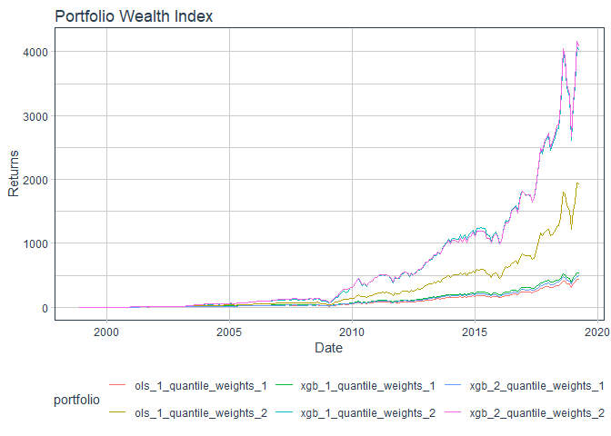
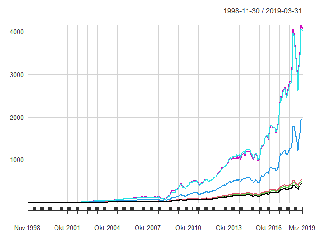
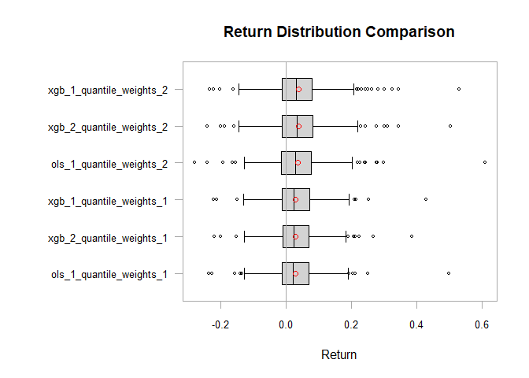

<!-- README.md is generated from README.Rmd. Please edit that file -->

# InvestigatoR <a href='https://github.com/ericschumann12/InvestigatoR'></a>

<!-- badges: start -->

[](https://www.repostatus.org/#active)

<!-- badges: end -->

# “InvestigatoR” that’s what she said!

The **goal of InvestigatoR** is to provide a comprehensive toolkit for
quantitative finance professionals and researchers to conduct advanced
backtesting and portfolio analysis using machine learning models. It
offers:

- a streamlined *workflow* for loading data
- specifying *features*
- configuring *machine learning models*
- and analyzing the *performance of predictions and portfolio
  strategies*.

This facilitates the evaluation of investment strategies, helping users
to optimize returns and manage risks more effectively in their financial
models.

It allows the user to retrieve:

- `backtesting()` a list of results from applying a portfolio mapping
  function over each out-of-sample date, providing insights into the
  performance of trading strategies based on specified features and
  historical data.
- `backtesting_returns()` a tibble with the stock_id, date and the
  predicted returns based on Machinelearning that later be used for a
  trading strategy
- `backtesting_portfolios()` a portfolio object suitable for further
  processing with summary or plot for backtesting portfolios given
  return predictions
- `helpers()` a tibble with columns training_start, training_end,
  prediction_start, prediction_end, and prediction_phase
- `mappers()` a tibble that contains the stock ID, date, and predicted
  returns. This function acts as a helper to map over indices and apply
  a specified machine learning model to predict returns, segmenting the
  data into training and testing sets based on given indices.
- `neural_network_predictions()` a list containing the trained model,
  the training history, and the predictions. This function normalizes
  the feature data, constructs and compiles a neural network model, fits
  the model to the training data, evaluates its performance on test
  data, and finally predicts investment decisions (e.g., to invest or
  not).
- `penreg_lasso()` a pair of model fits (“fit_lasso” and “fit_ridge”),
  which are the outcomes of penalized regression models applied to the
  specified predictor (x_penalized) and response (y_penalized)
  variables.
- `portfolio_objects()` a returnPrediction S3 object that organizes
  stock IDs, dates, actual returns, and placeholders for predictions and
  errors, facilitating structured tracking and analysis of return
  predictions.
- `random_foreest_predictor()` predictions from a random forest model
  trained on specified features and data, using user-defined settings
  for the number of trees, node size, sample size, and variables per
  split.
- `returnPredictors()` tibble with stock_id, date and pred_return
  matching the test_data based on the chose of the two primary modeling
  techniques/functions (“ols_pred()” using an ordinary least squares
  regression with a choice between a fast implementation with
  RcppArmadillo or a standard implementation with base R’s lm function
  or “xgb_pred”()” using an XGBoost model trained with either
  user-specified settings or default parameters (like learning rate,
  tree depth, and number of rounds to optimize prediction accuracy)).
- `weight_functions()`a tibble with stock_id, date, and weights based on
  predictions with given constraints like “quantile_weights()” where
  weights are assigned based on quantiles of predictions, allowing for
  configurations such as allowing short sales, specifying maximum and
  minimum weights for individual stocks, and adjusting the total weight
  in long and short positions or “ensemble_weights()”, where weights are
  calculated using different methods such as a simple average of
  predictions, a weighted average based on the inverse of average
  errors, or using the covariance of prediction errors to determine the
  weighting scheme.
- `InvestigatoR-package()` a package that provides a comprehensive
  toolkit for quantitative finance professionals and researchers to
  conduct advanced backtesting and portfolio analysis using machine
  learning models.

# Installation

You can install the development version of InvestigatoR from
[GitHub](https://github.com/) with:

``` r
# install.packages("devtools")
devtools::install_github("ericschumann12/InvestigatoR")
```

# Package Contribution

tbd

# Package Usage

This is a basic example which shows you how to solve a common problem:

First we load the `InvestigatoR`-package and the `tidyverse`-package:

``` r
library(InvestigatoR)
#> Registered S3 method overwritten by 'quantmod':
#>   method            from
#>   as.zoo.data.frame zoo
library(tidyverse)
#> ── Attaching core tidyverse packages ──────────────────────── tidyverse 2.0.0 ──
#> ✔ dplyr     1.1.4     ✔ readr     2.1.5
#> ✔ forcats   1.0.0     ✔ stringr   1.5.1
#> ✔ ggplot2   3.5.1     ✔ tibble    3.2.1
#> ✔ lubridate 1.9.3     ✔ tidyr     1.3.1
#> ✔ purrr     1.0.2
#> ── Conflicts ────────────────────────────────────────── tidyverse_conflicts() ──
#> ✖ dplyr::filter() masks stats::filter()
#> ✖ dplyr::lag()    masks stats::lag()
#> ℹ Use the conflicted package (<http://conflicted.r-lib.org/>) to force all conflicts to become errors
## basic example code
```

Next we load the complimentary dataset that comes with the package:

``` r
data("data_ml")
data_ml |> distinct(date) |> pull(date) |> min()
#> [1] "1998-11-30"
data_ml |> distinct(date) |> pull(date) |> max()
#> [1] "2019-03-31"
```

For a description, see…. The original datset was provided by Guillaume
Coqueret and Tony Guida with their book [Machine Learning for Factor
Investing](https://mlfactor.com).

Next we specify the set of features that should be used for return
prediction, specify some options for backtesting, such as whether the
return prediction should be done with a rolling window (TRUE), the
window size (“5 years”), the step size(“3 months”, this means, how often
do we reestimate the ML model), the offset (“1 year” to avoid any form
of data spillage).

``` r
return_label <- "R1M_Usd"
features <- c("Div_Yld", "Eps", "Mkt_Cap_12M_Usd", "Mom_11M_Usd", "Ocf", "Pb", "Vol1Y_Usd")
rolling <- FALSE; window_size= "5 years"; step_size = "1 months"; offset = "1 month"; in_sample = TRUE
```

Next we specify the machine learning configuration. We can specify
multiple configurations, for example, one for a linear regression model
and one for a gradient boosting model. The configuration for the linear
regression model is empty, as we use the default configuration. The
configuration for the gradient boosting model specifies the number of
rounds, the maximum depth of the trees, the learning rate, and the
objective function. Other functions still need to be implemented.

``` r
 ml_config <- list(ols_pred = list(pred_func="ols_pred", config=list()),
                   xgb_pred = list(pred_func="xgb_pred", 
                                   config1=list(nrounds=10, max_depth=3, eta=0.3, objective="reg:squarederror"),
                                   config2=list(nrounds=10, max_depth=3, eta=0.1, objective="reg:squarederror")))
```

Finally, we call the backtesting function. The function returns a data
frame with the backtesting results. The data frame contains the
following columns: date, return_label, features, rolling, window_size,
step_size, offset, in_sample, ml_config, model, predicted returns,
actual realized returns, and errors for all predictions. The model
column contains the name of the model that was used for the prediction.
The prediction column contains the predicted returns. The actual column
contains the actual returns. The error column contains the difference
between the predicted and the actual returns.

``` r
 rp <- backtesting_returns(data=data_ml, return_prediction_object=NULL,
   return_label, features, rolling=FALSE, window_size, step_size, offset, in_sample, ml_config, append=FALSE, num_cores=NULL)
#> Currently processing model 1 of 2 
#> Specifically processing config 1 of 1 
#> Currently processing model 2 of 2 
#> Specifically processing config 1 of 2
#> Warning: UNRELIABLE VALUE: Future ('<none>') unexpectedly generated random
#> numbers without specifying argument 'seed'. There is a risk that those random
#> numbers are not statistically sound and the overall results might be invalid.
#> To fix this, specify 'seed=TRUE'. This ensures that proper, parallel-safe
#> random numbers are produced via the L'Ecuyer-CMRG method. To disable this
#> check, use 'seed=NULL', or set option 'future.rng.onMisuse' to "ignore".
#> Specifically processing config 2 of 2
#> Warning: UNRELIABLE VALUE: Future ('<none>') unexpectedly generated random
#> numbers without specifying argument 'seed'. There is a risk that those random
#> numbers are not statistically sound and the overall results might be invalid.
#> To fix this, specify 'seed=TRUE'. This ensures that proper, parallel-safe
#> random numbers are produced via the L'Ecuyer-CMRG method. To disable this
#> check, use 'seed=NULL', or set option 'future.rng.onMisuse' to "ignore".
```

Next we take this predictions and analyse thbeir statistical properties

``` r
rp$predictions |> head()
#> # A tibble: 6 × 5
#>   stock_id date        ols_1  xgb_1 xgb_2
#>      <int> <date>      <dbl>  <dbl> <dbl>
#> 1       13 2006-12-31 0.0305 0.0402 0.191
#> 2       13 2007-01-31 0.0308 0.0397 0.191
#> 3       13 2007-02-28 0.0300 0.0439 0.193
#> 4       17 2015-03-31 0.0336 0.110  0.223
#> 5       17 2015-04-30 0.0343 0.0734 0.222
#> 6       17 2015-05-31 0.0344 0.0987 0.214
rp_stats <- summary(rp)
print(rp_stats)
#>       MSE        RMSE      MAE        Hit_Ratio
#> ols_1 0.03158888 0.1777326 0.08071823 0.5352989
#> xgb_1 0.03142746 0.1772779 0.08193929 0.5529501
#> xgb_2 0.06060931 0.2461896 0.1848615  0.5525796
```

Next, we map those predictions into various portfolios (quantiles) and
analyse their performance. We specify various weight restrictions, such
as the minimum and maximum weight, the minimum and maximum cutoff
quantile, and the b parameter that adjusts the amount of investment per
leg (b=1 means, we go 100% long and short). We also specify the
predictions that should be used for the portfolio formation (e.g.,
ols_1, xgb_1, xgb_2).

``` r
pf_config <- list(predictions = c("ols_1","xgb_1","xgb_2"),
                  quantile_weight = list(pred_func="quantile_weights",
                    config1=list(quantiles = list(long = 0.20, short = 0.20),allow_short_sale = FALSE,
                      min_weight = -1,  max_weight = 1, b = 1),
                    config2=list(quantiles = list(long = 0.10, short = 0.10),allow_short_sale = FALSE,
                      min_weight = -1,  max_weight = 1, b = 1)))
```

Finally we run the portfolio formation process.

``` r
pf <- backtesting_portfolios(return_prediction_object = rp, pf_config = pf_config)
#> Currently processing weight model 1 of 1 
#> Specifically processing config 1 of 2 
#> Specifically processing config 2 of 2
```

Let us check the content of pf, and calculate some summary statistics

``` r
pf$weights |> head()
#> # A tibble: 6 × 8
#>   stock_id date       ols_1_quantile_weights_1 xgb_1_quantile_weights_1
#>      <int> <date>                        <dbl>                    <dbl>
#> 1       13 2006-12-31                  0.00418                  0.00418
#> 2       13 2007-01-31                  0.00418                  0.00418
#> 3       13 2007-02-28                  0.00418                  0.00418
#> 4       17 2015-03-31                  0.00418                  0.00418
#> 5       17 2015-04-30                  0.00418                  0.00418
#> 6       17 2015-05-31                  0.00418                  0.00418
#> # ℹ 4 more variables: xgb_2_quantile_weights_1 <dbl>,
#> #   ols_1_quantile_weights_2 <dbl>, xgb_1_quantile_weights_2 <dbl>,
#> #   xgb_2_quantile_weights_2 <dbl>
pf$portfolio_returns |> head()
#> # A tibble: 6 × 7
#>   date       ols_1_quantile_weights_1 xgb_1_quantile_weights_1
#>   <date>                        <dbl>                    <dbl>
#> 1 2006-12-31                0.0184                     0.0171 
#> 2 2007-01-31                0.0189                     0.0177 
#> 3 2007-02-28                0.0160                     0.0166 
#> 4 2015-03-31               -0.0000879                 -0.00412
#> 5 2015-04-30                0.00680                    0.00849
#> 6 2015-05-31               -0.00671                   -0.0102 
#> # ℹ 4 more variables: xgb_2_quantile_weights_1 <dbl>,
#> #   ols_1_quantile_weights_2 <dbl>, xgb_1_quantile_weights_2 <dbl>,
#> #   xgb_2_quantile_weights_2 <dbl>
pf_stats <- summary(pf)
print(pf_stats)
#> # A tibble: 6 × 6
#>   portfolio                  mean     sd    SR   VaR_5 turnover
#>   <chr>                     <dbl>  <dbl> <dbl>   <dbl>    <dbl>
#> 1 ols_1_quantile_weights_1 0.0280 0.0773 0.362 -0.0905     93.7
#> 2 ols_1_quantile_weights_2 0.0352 0.0904 0.389 -0.0995    120. 
#> 3 xgb_1_quantile_weights_1 0.0287 0.0753 0.382 -0.0915    110. 
#> 4 xgb_1_quantile_weights_2 0.0385 0.0937 0.411 -0.105     135. 
#> 5 xgb_2_quantile_weights_1 0.0282 0.0733 0.385 -0.0855     90.1
#> 6 xgb_2_quantile_weights_2 0.0383 0.0904 0.424 -0.0916    118.
```

Alternatively, we can also calculate statistics from the
`PerformanceAnalytics` package.

``` r
library(tidyquant)
#> Loading required package: PerformanceAnalytics
#> Loading required package: xts
#> Loading required package: zoo
#> 
#> Attaching package: 'zoo'
#> The following objects are masked from 'package:base':
#> 
#>     as.Date, as.Date.numeric
#> 
#> Attaching package: 'xts'
#> The following objects are masked from 'package:dplyr':
#> 
#>     first, last
#> 
#> Attaching package: 'PerformanceAnalytics'
#> The following object is masked from 'package:graphics':
#> 
#>     legend
#> Loading required package: quantmod
#> Loading required package: TTR
# tidyquant::tq_performance_fun_options()
summary(pf)
#> # A tibble: 6 × 6
#>   portfolio                  mean     sd    SR   VaR_5 turnover
#>   <chr>                     <dbl>  <dbl> <dbl>   <dbl>    <dbl>
#> 1 ols_1_quantile_weights_1 0.0280 0.0773 0.362 -0.0905     93.7
#> 2 ols_1_quantile_weights_2 0.0352 0.0904 0.389 -0.0995    120. 
#> 3 xgb_1_quantile_weights_1 0.0287 0.0753 0.382 -0.0915    110. 
#> 4 xgb_1_quantile_weights_2 0.0385 0.0937 0.411 -0.105     135. 
#> 5 xgb_2_quantile_weights_1 0.0282 0.0733 0.385 -0.0855     90.1
#> 6 xgb_2_quantile_weights_2 0.0383 0.0904 0.424 -0.0916    118.
summary(pf, type = "table.AnnualizedReturns")
#> Warning: Non-numeric columns being dropped: date
#> Using column `date` for date_var.
#>                           ols_1_quantile_weights_1 xgb_1_quantile_weights_1
#> Annualized Return                           0.3470                   0.3611
#> Annualized Std Dev                          0.2678                   0.2607
#> Annualized Sharpe (Rf=0%)                   1.2959                   1.3849
#>                           xgb_2_quantile_weights_1 ols_1_quantile_weights_2
#> Annualized Return                           0.3544                   0.4486
#> Annualized Std Dev                          0.2538                   0.3132
#> Annualized Sharpe (Rf=0%)                   1.3963                   1.4323
#>                           xgb_1_quantile_weights_2 xgb_2_quantile_weights_2
#> Annualized Return                           0.5015                   0.5024
#> Annualized Std Dev                          0.3247                   0.3133
#> Annualized Sharpe (Rf=0%)                   1.5447                   1.6036
summary(pf, type = "table.Distributions")
#> Warning: Non-numeric columns being dropped: date
#> Using column `date` for date_var.
#>                        ols_1_quantile_weights_1 xgb_1_quantile_weights_1
#> monthly  Std Dev                         0.0773                   0.0753
#> Skewness                                 0.7575                   0.5217
#> Kurtosis                                 8.7266                   6.4319
#> Excess kurtosis                          5.7266                   3.4319
#> Sample skewness                          0.7669                   0.5281
#> Sample excess kurtosis                   5.8701                   3.5278
#>                        xgb_2_quantile_weights_1 ols_1_quantile_weights_2
#> monthly  Std Dev                         0.0733                   0.0904
#> Skewness                                 0.4446                   1.0366
#> Kurtosis                                 5.7883                   9.9508
#> Excess kurtosis                          2.7883                   6.9508
#> Sample skewness                          0.4501                   1.0495
#> Sample excess kurtosis                   2.8709                   7.1197
#>                        xgb_1_quantile_weights_2 xgb_2_quantile_weights_2
#> monthly  Std Dev                         0.0937                   0.0904
#> Skewness                                 0.8782                   0.8076
#> Kurtosis                                 6.5942                   6.4552
#> Excess kurtosis                          3.5942                   3.4552
#> Sample skewness                          0.8890                   0.8175
#> Sample excess kurtosis                   3.6935                   3.5517
summary(pf, type = "table.DownsideRisk")
#> Warning: Non-numeric columns being dropped: date
#> Using column `date` for date_var.
#>                              ols_1_quantile_weights_1 xgb_1_quantile_weights_1
#> Semi Deviation                                 0.0515                   0.0506
#> Gain Deviation                                 0.0605                   0.0578
#> Loss Deviation                                 0.0479                   0.0451
#> Downside Deviation (MAR=10%)                   0.0420                   0.0406
#> Downside Deviation (Rf=0%)                     0.0385                   0.0370
#> Downside Deviation (0%)                        0.0385                   0.0370
#> Maximum Drawdown                               0.5227                   0.5017
#> Historical VaR (95%)                          -0.0905                  -0.0915
#> Historical ES (95%)                           -0.1353                  -0.1291
#> Modified VaR (95%)                            -0.0725                  -0.0781
#> Modified ES (95%)                             -0.0725                  -0.0989
#>                              xgb_2_quantile_weights_1 ols_1_quantile_weights_2
#> Semi Deviation                                 0.0495                   0.0583
#> Gain Deviation                                 0.0559                   0.0737
#> Loss Deviation                                 0.0441                   0.0540
#> Downside Deviation (MAR=10%)                   0.0397                   0.0455
#> Downside Deviation (Rf=0%)                     0.0361                   0.0421
#> Downside Deviation (0%)                        0.0361                   0.0421
#> Maximum Drawdown                               0.4732                   0.5624
#> Historical VaR (95%)                          -0.0855                  -0.0995
#> Historical ES (95%)                           -0.1262                  -0.1486
#> Modified VaR (95%)                            -0.0785                  -0.0722
#> Modified ES (95%)                             -0.1049                  -0.0722
#>                              xgb_1_quantile_weights_2 xgb_2_quantile_weights_2
#> Semi Deviation                                 0.0597                   0.0583
#> Gain Deviation                                 0.0775                   0.0736
#> Loss Deviation                                 0.0519                   0.0502
#> Downside Deviation (MAR=10%)                   0.0448                   0.0437
#> Downside Deviation (Rf=0%)                     0.0414                   0.0402
#> Downside Deviation (0%)                        0.0414                   0.0402
#> Maximum Drawdown                               0.5167                   0.4836
#> Historical VaR (95%)                          -0.1053                  -0.0916
#> Historical ES (95%)                           -0.1463                  -0.1427
#> Modified VaR (95%)                            -0.0838                  -0.0820
#> Modified ES (95%)                             -0.0937                  -0.0936
summary(pf, type = "table.DrawdownsRatio")
#> Warning: Non-numeric columns being dropped: date
#> Using column `date` for date_var.
#>                ols_1_quantile_weights_1 xgb_1_quantile_weights_1
#> Sterling ratio                   0.5572                   0.6002
#> Calmar ratio                     0.6638                   0.7198
#> Burke ratio                      0.4231                   0.4543
#> Pain index                       0.0374                   0.0357
#> Ulcer index                      0.0861                   0.0830
#> Pain ratio                       9.2826                  10.1193
#> Martin ratio                     4.0290                   4.3518
#>                xgb_2_quantile_weights_1 ols_1_quantile_weights_2
#> Sterling ratio                   0.6183                   0.6772
#> Calmar ratio                     0.7490                   0.7976
#> Burke ratio                      0.4630                   0.5027
#> Pain index                       0.0326                   0.0365
#> Ulcer index                      0.0753                   0.0901
#> Pain ratio                      10.8872                  12.2911
#> Martin ratio                     4.7070                   4.9791
#>                xgb_1_quantile_weights_2 xgb_2_quantile_weights_2
#> Sterling ratio                   0.8132                   0.8609
#> Calmar ratio                     0.9706                   1.0390
#> Burke ratio                      0.5724                   0.5918
#> Pain index                       0.0373                   0.0350
#> Ulcer index                      0.0873                   0.0809
#> Pain ratio                      13.4421                  14.3659
#> Martin ratio                     5.7468                   6.2130
summary(pf, type = "cov")
#> Warning: Non-numeric columns being dropped: date
#> Using column `date` for date_var.
#>                          ols_1_quantile_weights_1 xgb_1_quantile_weights_1
#> ols_1_quantile_weights_1              0.005974579              0.005773093
#> xgb_1_quantile_weights_1              0.005773093              0.005664717
#> xgb_2_quantile_weights_1              0.005595153              0.005481785
#> ols_1_quantile_weights_2              0.006771307              0.006538059
#> xgb_1_quantile_weights_2              0.006981303              0.006848935
#> xgb_2_quantile_weights_2              0.006657444              0.006564361
#>                          xgb_2_quantile_weights_1 ols_1_quantile_weights_2
#> ols_1_quantile_weights_1              0.005595153              0.006771307
#> xgb_1_quantile_weights_1              0.005481785              0.006538059
#> xgb_2_quantile_weights_1              0.005368910              0.006328466
#> ols_1_quantile_weights_2              0.006328466              0.008175970
#> xgb_1_quantile_weights_2              0.006637890              0.008148268
#> xgb_2_quantile_weights_2              0.006366076              0.007930356
#>                          xgb_1_quantile_weights_2 xgb_2_quantile_weights_2
#> ols_1_quantile_weights_1              0.006981303              0.006657444
#> xgb_1_quantile_weights_1              0.006848935              0.006564361
#> xgb_2_quantile_weights_1              0.006637890              0.006366076
#> ols_1_quantile_weights_2              0.008148268              0.007930356
#> xgb_1_quantile_weights_2              0.008785115              0.008292291
#> xgb_2_quantile_weights_2              0.008292291              0.008180366
```

Now we plot the corresponding cumulative returns of the portfolios

``` r
plot(pf)
```



Alternatively, the plotting function is designed in a way, that it takes
plotting function from the `tidyquant` package as inputs.

``` r
library(tidyquant)
ls("package:PerformanceAnalytics")[grepl("chart",ls("package:PerformanceAnalytics"))]
#>  [1] "chart.ACF"                       "chart.ACFplus"                  
#>  [3] "chart.Bar"                       "chart.BarVaR"                   
#>  [5] "chart.Boxplot"                   "chart.CaptureRatios"            
#>  [7] "chart.Correlation"               "chart.CumReturns"               
#>  [9] "chart.Drawdown"                  "chart.ECDF"                     
#> [11] "chart.Events"                    "chart.Histogram"                
#> [13] "chart.QQPlot"                    "chart.Regression"               
#> [15] "chart.RelativePerformance"       "chart.RiskReturnScatter"        
#> [17] "chart.RollingCorrelation"        "chart.RollingMean"              
#> [19] "chart.RollingPerformance"        "chart.RollingQuantileRegression"
#> [21] "chart.RollingRegression"         "chart.Scatter"                  
#> [23] "chart.SnailTrail"                "chart.StackedBar"               
#> [25] "chart.TimeSeries"                "chart.VaRSensitivity"           
#> [27] "charts.Bar"                      "charts.BarVaR"                  
#> [29] "charts.PerformanceSummary"       "charts.RollingPerformance"      
#> [31] "charts.RollingRegression"        "charts.TimeSeries"
plot(pf, type = "chart.CumReturns")
#> Using column `date` for date_var.
```



``` r
plot(pf, type = "charts.PerformanceSummary")
#> Using column `date` for date_var.
```


``` r
plot(pf, type = "chart.Boxplot")
#> Using column `date` for date_var.
```



### Author/License

- **Investigator Team and Ass.-Prof. Dr. Sebastian Stöckl** - Package
  Creator, Modifier & Maintainer - [sstoeckl on
  github](https://github.com/sstoeckl)

This project is licensed under the MIT License - see the \<license.md\>
file for details\</license.md\>

### Acknowledgments

tbd
